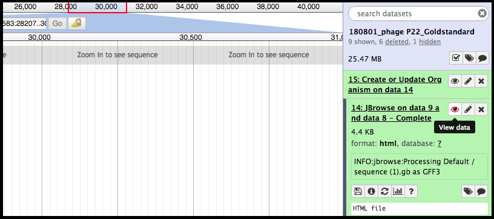
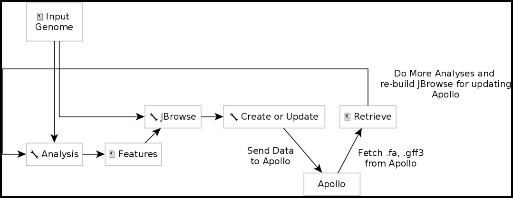
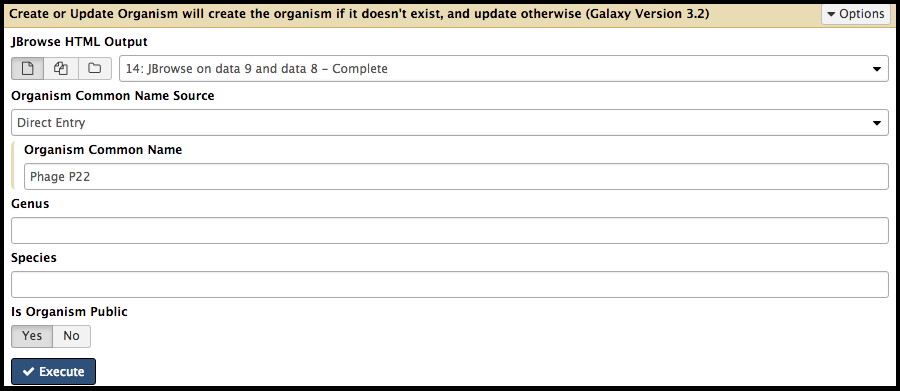

# The Galaxy-Apollo Bridge

It is important to understand that Apollo is not just another tool or workflow in Galaxy. Apollo is a separate, stand-alone program that specializes in the display and editing of JBrowse genome annotations. The CPT has developed a tool called JBrowse-in-Galaxy (JiG), which can build JBrowse instances within Galaxy and then export them into Apollo where they can be accessed by the user. 

### 1. JBrowse in Galaxy

The CPT developed a tool called JBrowse-in-Galaxy (JiG), which allows the building of JBrowse instances within Galaxy; this contrasts with how JBrowse instances are traditionally configured, through a complex and manual process at the command line. 

The CPT uses JBrowse as a tool for displaying the results of a bioinformatic analysis in a standardized way; instead of having to digest and understand 20+ different report formats, images, output files, tables, etc., all of our analyses are presented as easy-to-grasp features in evidence tracks. As its input, Apollo takes complete JBrowse instances. To view any data in Apollo, a JBrowse instance needs to be configured first. On the far left side of the Galaxy web page is a “Tools” column with a search bar. Search [“JBrowse genome browser”](https://cpt.tamu.edu/galaxy/root?tool_id=jbrowse) and click on the synonymous link underneath “CPT: Genomic Viz.”

It is vital that the correct files are elected for the steps in the tool, otherwise the tool will not run. Once you’v created a JBrowse instance, it will appear in the history column on the left side of the Galaxy page. To see the JBrowse instance, click on the corresponding eyeball  symbol; clicking on the JBrowse instance step will reveal more details and options. If desired, clicking on the floppy disk symbol will save the JBrowse instance to the local device. This is typically unnecessary, as it will remain stored within the Galaxy history.

### 2. Moving Data From Galaxy to Apollo

With a complete JBrowse instance, data can now be channeled to Apollo. Data is built up in Galaxy in the form of a JBrowse instance, which is then pushed to the Apollo service in the *Create or Update Organism* step. Once annotations have been made on the organism’s genome in Apollo, the updated set of annotations can be exported into Galaxy, and then re-analyzed for another update in Apollo with the new results.

**Create or Update Organism** is a tool that allows for the creation/updating of an organism in Apollo with new data from Galaxy in the form of a JBrowse instance. The [Create or Update Organism](https://cpt.tamu.edu/galaxy/root?tool_id=edu.tamu.cpt2.webapollo.create_or_update) tool can be found using the search function in the Tools column in Galaxy, underneath “CPT: Apollo.”

> ###  Note that…
> You **_must_** fill out the Organism Common Name. If the phage is “P22,” it is recommended that
>    > * If possible, the FASTA file header reads *>P22* (and nothing else), and
>    > * “P22” is typed into the Organism Common name field in this tool.
> Like with the JBrowse Instance tool, if the fields are not filled correctly, the tool will *not* run, or will run *incorrectly*.
{: .tip}

Executing this step will transfer data to Apollo and produce a JSON (JavaScript Object Notation) file. The output JSON file contains some metadata about the organism. With the data available in Apollo, it can be accessed at [Apollo](https://cpt.tamu.edu/apollo/annotator/index); accessing Apollo requires logging into Galaxy. The genome can also be accessed via the “Annotate on data #” step in the history column by clicking the eye  symbol. The Annotate tool takes the JSON file from the **Create or Update Organism** step and loads Apollo directly in Galaxy.
{: .details}

